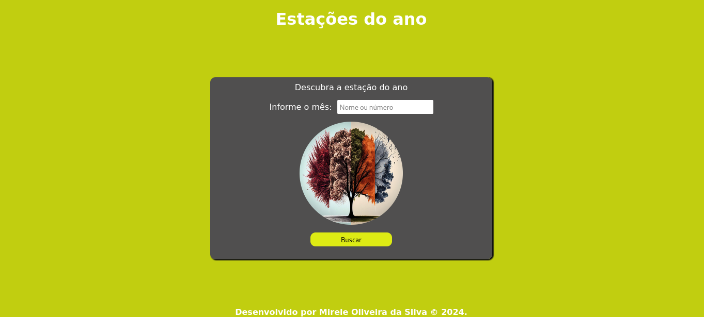
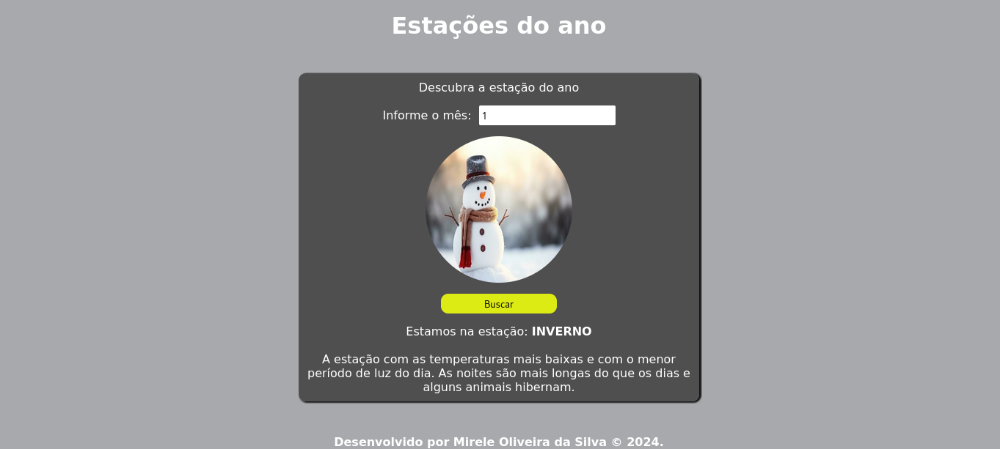
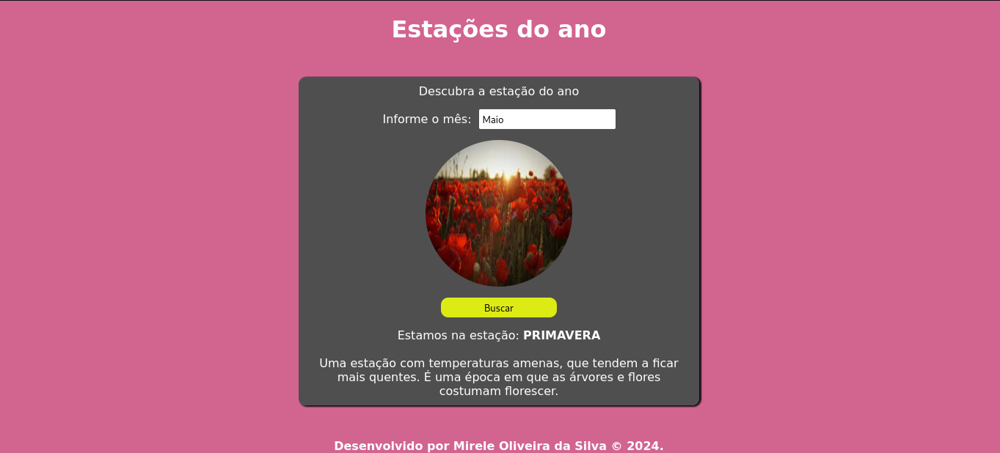
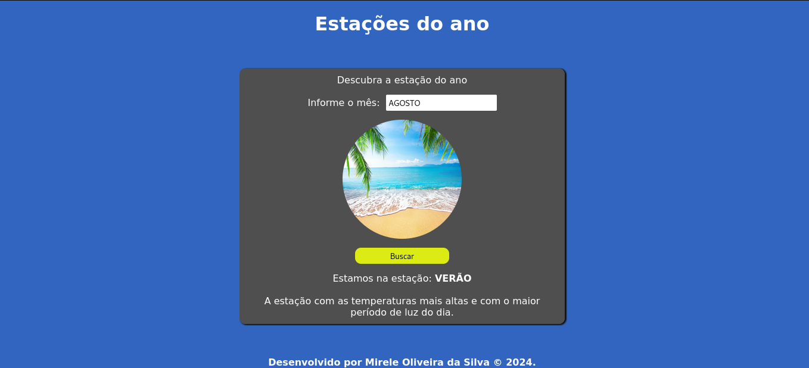
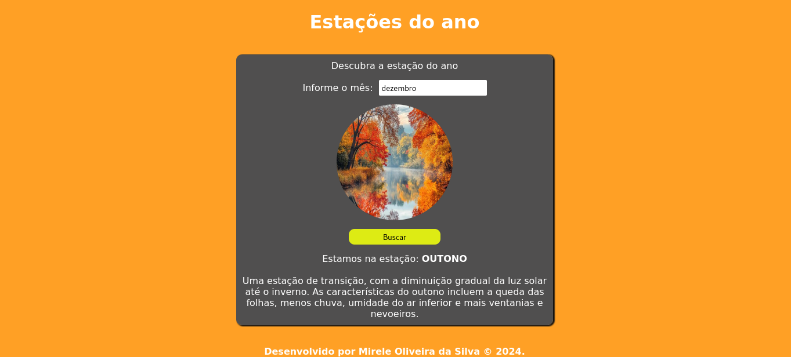

  <h1>Estações do ano</h1>
    
    
    
     
     
     

Este projeto consiste em uma página web desenvolvida com HTML, CSS e JavaScript, que solicita ao usuário que informe o nome ou número de um mês do ano e, em seguida, exibe a estação correspondente.

Foi utilizada a função toLowerCase() para converter letras maiúsculas e minúsculas, e a função trim() para remover espaços em branco, o que ajuda a normalizar o valor de entrada e evita problemas relacionados a diferenças de capitalização ou espaços extras.

Além disso, ao exibir a estação correspondente, a cor da página e a imagem de fundo mudam de acordo com as características da estação.

  
Desenvolvido por <a target="_blank" rel="external" href="https://github.com/MegMinnie/"><strong>Mirele Oliveira da Silva</strong></a>

 

 

  
  ## Como Acessar a Aplicação

Acesse a aplicação por meio do link: <a href="https://megminnie.github.io/Estacoes-do-ano/
"_blank">clique aqui</a>

## Screenshots

